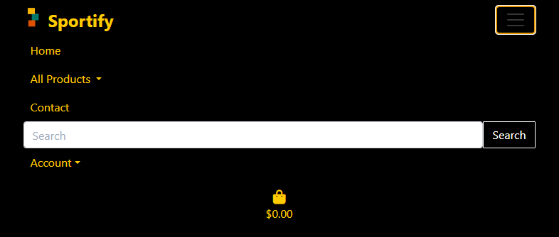
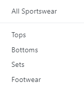
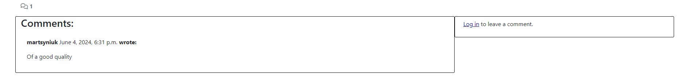
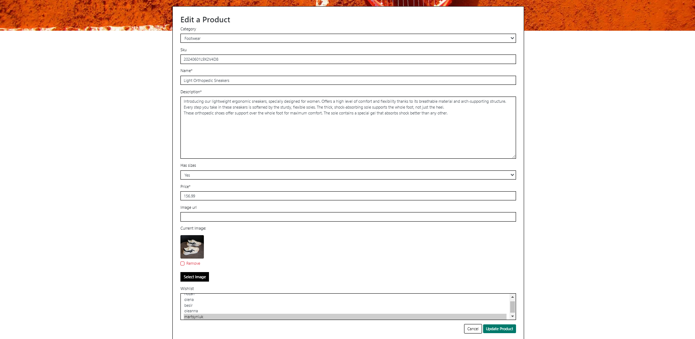
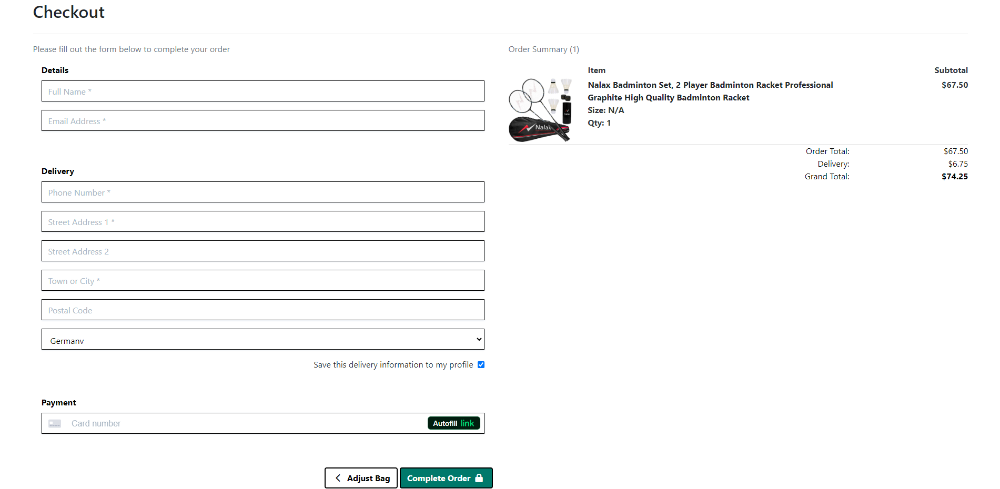
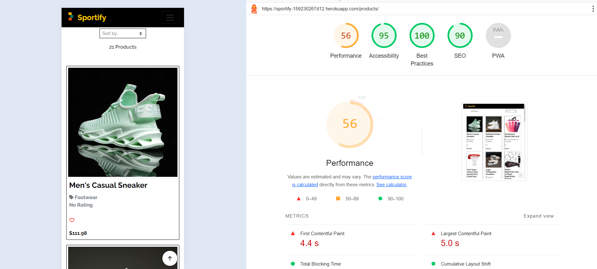

# Sportify

Sportify is a B2C (Business-to-Consumer) online store dedicated to providing a wide range of sporting goods. It serves to individual customers looking for high-quality sportswear, footwear, and equipment.

Core Business Intents:

Product Range: Offering a comprehensive selection of sporting products, including apparel, footwear, and equipment.
User Experience: Enhancing shopping ease with features like product sorting, category sorting, user reviews.
Customer Engagement: Enabling user interaction through reviews, and ratings, adding products to wishlist.

Marketing Strategies:

Social Media Integration: Active engagement on platforms like Facebook to drive traffic and build community.
Email Marketing: Users Subscribe for newsletter to receive exclusive offers and updates.

Visit the deployed site - https://sportify-159230267d12.herokuapp.com/

## Features

The Sportify website offers several key features for its users.

### Existing Features
___

__Navigation Bar:__

The Navigation Bar is featured on all pages of the website. It is fixed. It enhances user experience by enabling quick access to different parts of the website and helps users find desired content.

Navbars are different for registered, not registered users and for a superuser.

The navbar includes the Logo, Home page, All Products drop-down menu, Contact page, Search form, Account drop-down menu(Sign In, Sign Up), and Shopping bag.

The navbar of <ins>registered user</ins> includes additiomnal pages on Account drop-down menu(My Profile, Wishlist, Sign Out)

The Account drop-down menu of <ins>a superuser</ins> has option "Add recipe" additionaly to the features of registered user.

##### All Products drop-down menu

It allows users to navigate through various categories and subcategories of products. 

<ins>All Products</ins> accesses the product listing, which can be sorted By Price, By Rating, By Category.

<ins>All Sportswear</ins> accesses all sportswear categories or can be accesses by subcategories - Tops, Bottoms, Sets, Footwear.

<ins>All Equipment</ins> accesses all equipment categories or can be accesses by subcategories  Protective Gear, Game Equipment, Training Equipment.

<ins>Special Offers</ins> accesses all categories or can be accesses by subcategories Sale, New Arrivals.

__Search__

It helps users quickly find specific products. The search functionality searches for products based on their category description and name. The search term and the count of products found are displayed.
Back to Products link allow users to go back to the products listing page, view the total number of products available.

__Footer:__

Footer is featured on all pages of the website. It provides easy access to important marketing links.
Copyright Information assures users that the content is up-to-date.
Social Media Link provides a link to the website's Facebook page.
Logo is placed in the middle of the footer.
Email Subscription Form includes an email address input field to subscribe for a newsletter.

__Home Page__

##### Carousel:

The carousel showcases visually appealing images related to the website's content to capture the user's attention and highlight key features, offers, and benefits of the website.

__Products Listing Page__

##### Recipe Entries Display:

The page displays a list of products entries, each presented as a card with details such as name, image, category, rating, price, and Add to Wishlist option. It provides users with a visually appealing layout for browsing multiple products at once.
Prodcts images and names are clickable, linking to the detailed view of each product. It enables seamless navigation to individual product pages for users interested in exploring further details.
Category name is clickable. Upon clicking it displays all products for that category.

##### Product Sorting accourding to Category

This feature displays which categories are currently selected for filtering and displayes the amout of products found.
The purpose of this feature is to provide users with a way to navigate through the products available on the website.

Back to Products link allow users to go back to the products listing page, view the total number of products available.

###### Sorting
A drop-down menu to sort a products by price, rating, category and name in ascending and descending orders.
User can select an option to organise proucts accourding to desired criteria.

__Contact__

##### Get in Touch Form:

It allows users to send a message or inquiry to the administrator by filling out a form, making it convenient for users to send contact request or provide feedback. Additionally, contact details(email, phone number, address) are provided on the left side.

__Wishlist:__

It gathers and presents all products that the user likes for later access. It enhances user experience by providing an organized and visually appealing way to browse through saved products. User can remove the product from the wishlist by clicking on the heart.

__My profile:__

The purpose of a profile page is to view and update their profile information and view order history. It is convenient to store default delivery information to simplify the checkout process for users. The order history allows users to keep track of their past purchases, making it easier for them to review previous orders.

__Product Detail Page__

The page displays detailed information about a specific product, including its image, title, description, category, average rating, price, size if applicable, quantity, navigation buttons "Keep Shopping" and "Add to Bag", Rating Form(for registered users),Leave a comment form(for registered users), and comments itself.

Provides users with comprehensive information about the product, helping them decide whether to buy it.

#### Add to Wishlist & Remove from Wishlist
Add to Wishlist allows users to add the product to their list of favorite products.
It enables users to bookmark products they like for quick access later. 
When a product is in the wishlist, the heart icon is solid red. When it is not in the wishlist, the heart icon has red borders. The hearts have titles attached to them, so when hovered over, they display "Add to Wishlist" or "Remove from Wishlist."

Registered users can add a product to wishlist. Not registered users see the message "Log in to add the product to wishlist".

#### Comments Section
Comments Section Facilitates user interaction by providing a platform for leaving comments on the product.
Encourages community engagement and discussion around the product.

Registered users can leave a comment, edit or delete it. It maintains the quality and relevance of the comment section.

#### Rating form
The rating form allows authenticated users to rate products on a scale of 1 to 5 stars. If a user has already rated a product, their rating is displayed with an option to delete it. For users who haven't rated yet, a star interface is provided to select a rating. 

Ratings help inform other consumers about product quality and assist businesses in understanding customer satisfaction.

When a star is hovered, it turns yellow. Users can rate the product only once; the stars have titles informing users about this limitation.

The average rating of the product and total count of ratings are displayed before product description. If no rating is available, it shows "No Rating".

##### Editing and Deleting Products Buttons:
Edit and Delete options allow a superuser to edit or delete a product fast.
It gives a superuser control over content, enabling them to make updates or remove outdated products as needed.

__Adding Products & Editing Products Forms__

The form provides a structured interface for a superuser to input details about the product.
It standardizes the submission process, ensuring that all necessary information is collected in a systematic manner. This helps maintain data consistency and makes it easier for a superuser to share the product.

Editing Products provides an easy way for a superuser to modify existing product details.

__Shopping Bag__

Users can review and modify selected products in the shopping bag, ensuring transition to the checkout process. It allows users to manage their selected products before purchase.

Shoppig bag shows product details, images, prices, and subtotals. Users can adjust item quantities using increment/decrement buttons or by entering the desired amount directly. Items can be easily removed from the cart.
Order Summary displays the total cost of items, delivery charges, and the grand total, with notifications for free delivery thresholds. Buttons navigate users to continue shopping or proceed to secure checkout.
Empty Cart Notification alerts users when their cart is empty and encourages them to continue shopping.

__Checkout__

The checkout is the final steps of the purchasing process, ensuring a secure payment.
It includes Order Summary, Customer Details, Delivery Information, Payment Section, Navigation Buttons (to return shopping cart for adjustments and a secure checkout button to complete the order).

__Checkout Success__

The checkout success page provides customers with confirmation and details of their completed purchase. It ensures that customers are well-informed about their purchase. 

It displays the order number, order date, and a summary of the items purchased, lists each item with its name, size, quantity, and price, shows the delivery address, billing details, order total, delivery cost, and the grand total, provides links for registered customers to return to their profile or explore special offers for not registered users.

__404__

It is displayed when a user tries to access a URL that does not exist or is not available. It ensures the user understands why they are not seeing the page. It has the link to homepage for navigation.

__User Authentication__

#### Sign In Section:
Allows registered users to sign in to their accounts and personalized content.
Users can input their credentials (username and password) to authenticate themselves.

#### Sign Out Section:
Allows authenticated users to sign out of their accounts. Displays a confirmation message asking users if they are sure they want to sign out.

#### Sign Up Section:
Enables new users to create an account.
Users can input necessary information (username, email, password) to register for an account.
If users already have an account, they are prompted to sign in instead.

#### Verify Email Address:

The Verify Your E-mail Address page informs the user that an email has been sent to them to verify their email address. It provides instructions on how to complete the verification process.

It ensures the email provided is accurate and owned by the user.

#### Confirm Email Address:

The Confirm E-mail Address page is used to finalize the email verification process by having the user confirm that the provided email address is correct and belongs to them.

## Features left to Implement

- First Purchase Discount, Sales
- Personalzed recommendations based on searches
- Live chart support
- Colors selection for products
- My reviews page
- Delete Account Option
- Saring products on social media
- Login with google or other social media
- Different payment options
- Saved payment information
- Blog

## UX Design

### The user experience (UX) of all pages:

__Navigation bar:__

Navigation bar to direct users to different sections of the website.
Search Functionality: Search form allowing users to find specific product quickly.

__User Authentication Pages (Sign Up, Sign In, Sign Out):__

Form Design: User-friendly forms for sign-up and sign-in processes with clear labels and instructions.
Registration and Login: Users can create accounts to track their orders, save preferences, and provide ratings, leave comments.

__Home Page:__

Visuals: Features images of game equipment, clothes, and sportspeople enticing users to explore further.
Content: Highlights main information about the website to engage users.
Call to Action: Prompts users to sign up, browse products, or check special offers.

__Products Listing Page:__

Grid Layout: Products displayed in grid layout with images, titles, prices, ratings, categories links, wishlist buttons.
Product Count: Displays the total number of products. If a search term or filters are applied, it shows a back link to all products and the search term used.
Category Badges: If categories are selected, badges are shown with links.
Sorting: Sort products by various criteria (price, name, category, rating) with the current sorting option displayed in the box.
Infinite Scroll: If there are many products, infinite scroll controls to manage the content.
User Guidance: Helpful messages and links guide users on how to navigate the product list, use the sorting feature, and add products to their wishlist.
Back-to-Top Button: A floating button at the bottom of the page allows users to quickly scroll back to the top.

__Product Detail Page:__

Product Presentation: Clear presentation of the product including name, image, wishlist button, category link, average rating, description, select box fr size and quantity.
Interaction: Ability for users to favorite products, leave comments, rate product, add product to bag.
Star Ratings: Users can rate products on a scale of 1 to 5 stars, providing feedback based on their experiences. A user can delete rating. Hovered stars are yellow. When a star is hovered, it turns yellow. Users can rate the product only once; the stars have titles informing users about this limitation.
Reviews: Customers can leave reviews, offering insights into product quality and performance. A user can delete or edit comment.
Validation: Only authenticated users can leave ratings and reviews, ensuring authenticity and reducing fake feedback.

__Account Feed:__ Overview of user's recent activity, such as products added to wishlist, profile page that contains delivery info and order history.

__Contact Page:__

Contact Info: Information about contacting options.
Get in Touch Form: A form for users to submit contact request.

__Purchase Process:__

Shopping Cart: Users can add products to a shopping cart and proceed to checkout.
Payment Integration: Secure payment support.
checkout form

__Wishlist__

Back to Products Link: A link to return to the main products page.
Wishlist Products Count: The number of products in the user's wishlist.
Product Cards: Products in the wishlist are displayed in a card layout.
Wishlist Management: A button allows users to remove the product from their wishlist. This button uses a heart icon. When a product is in the wishlist, the heart icon is solid red. When it is not in the wishlist, the heart icon has red borders. The hearts have titles attached to them, so when hovered over, they display "Add to Wishlist" or "Remove from Wishlist."

__Profile Page__

Information Section: A section with a form to update delivery information.
Update Button: A button to submit the form and update the delivery information.
Order History Table: A table displaying past orders.

__Checkout Process__
Order Summary: List of items with images, details, and totals.
Checkout Form: Sections for personal details, delivery info, and payment.
Action Buttons: Adjust Bag, Complete Order, and charge notification.
Loading Overlay: Spinner indicating payment processing.
After uccessful payment the user is redirected to Checkout success page.
Order Confirmation: Details including order number, date, items, delivery, and billing information.
Back Button: Link to either profile for registered users or latest deals for not registered users.

__Add and Edit Recipe Page:__

Form Design: Intuitive form for a superusers to input product details
Validation: Validation checks to ensure all required fields are filled out correctly.
Image Upload: Option to upload images of the product for visual appeal. Image is previewed.

### Messages:

Messages are used to provide feedback to users after performing actions, such as signing in, signing out, loging in, email verification, email confirmation, adding, editing, or deleting a product or comment, submitting review. These messages are displayed using Django's built-in message framework (django.contrib.messages), ensuring that users are informed about the outcome of their actions.
Different message levels (e.g., messages.SUCCESS, messages.ERROR, messages.INFO, messages.ALERT) are used to convey the nature of the message, whether it's a success message or an error message.
Messages enhance the user experience by providing immediate feedback, helping users understand the result of their interactions with the platform.

### Modal Dialogs:

Modal dialogs are used for confirmation prompts when performing critical actions like deleting a prouduct or comment. These dialogs ensure that a superuser and users confirm their intent before proceeding with potentially irreversible actions.

### Style

__Body Font:__ "Raleway", sans-serif a fallback font. 
The "Raleway" font is used for the website body, which was imported from Google Fonts. In case the main font fails to load properly, the backup font "Sans Serif" is used to ensure consistent readability across the site.

__Colors:__

- #000000: Black
- #FFFFFF: White
- #ffcc00: Yellow
- #A2ACBD: Darkgrey
- #00796B: Green
- #0000ff: Blue
- #00008b: DarkBlue
- #ff0000: Red
- #9E0000: Darkred

Bootstrap Colors
- arrow-primary #007bff
- arrow-secondary #6c757d
- arrow-success #28a745
- arrow-danger #dc3545
- arrow-warning #ffc107
- arrow-info #17a2b8
- arrow-light #f8f9fa
- arrow-dark black

## Data Model

The data model defines the structure for ContactRequest, Category, Product, Rating, Comment, Order, OrderLineItem, and UserProfile models.

1. ContactRequest Model stores contact requests submitted by users.
- name: A CharField for the user's name (max length 255).
- email: An EmailField for the user's email address.
- message: A TextField for the user's message.
- created_at: A DateTimeField automatically set to the current date and time when a request is created.
- read: A BooleanField indicating whether the message has been read (default is False).

2. Category Model categorizes products
- name: A CharField for the category name (max length 254).
- friendly_name: A CharField for a user-friendly name (max length 254).

3. Product Model store product details.
- category: A ForeignKey - Category (nullable, with SET_NULL on deletion).
- sku: A CharField for the stock keeping unit (max length 254, nullable, and blank).
- name: A CharField for the product name (max length 254).
- description: A TextField for the product description.
- has_sizes: A BooleanField indicating if the product has sizes (default is False, nullable, and blank).
- price: A DecimalField for the product price (max digits 6, decimal places 2).
- image_url: A URLField for the product image URL (max length 1024, nullable, and blank).
- image: An ImageField for the product image (nullable and blank).
- wishlist: A ManyToManyField - User (blank, related name favorite).

4. Rating Model stores product ratings
- product: A ForeignKey - Product (with CASCADE on deletion).
- user: A ForeignKey - User (with CASCADE on deletion).
- score: An IntegerField with choices for rating (1 to 5 stars).

5. Comment Model stores comments on products.
- product: A ForeignKey - Product (with CASCADE on deletion, related name comments).
- author: A ForeignKey - User (with CASCADE on deletion, related name comments).
- body: A TextField for the comment text.
- created_on: A DateTimeField automatically set to the current date and time when a comment is created.

6. Order Model stores order details.
- order_number: A CharField for the unique order number (max length 32, not editable).
- user_profile: A ForeignKey - UserProfile (nullable, with SET_NULL on deletion, related name orders).
- full_name: A CharField for the user's full name (max length 50).
- email: An EmailField for the user's email address (max length 254).
- phone_number: A CharField for the user's phone number (max length 20).
- country: A CountryField for the user's country.
- postcode: A CharField for the postal code (max length 20, nullable, and blank).
- town_or_city: A CharField for the town or city (max length 40).
- street_address1: A CharField for the primary street address (max length 80).
- street_address2: A CharField for the secondary street address (max length 80, nullable, and blank).
- date: A DateTimeField automatically set to the current date and time when an order is created.
- delivery_cost: A DecimalField for the delivery cost (max digits 6, decimal places 2, default 0).
- order_total: A DecimalField for the order total (max digits 10, decimal places 2, default 0).
- grand_total: A DecimalField for the grand total (max digits 10, decimal places 2, default 0).
- original_bag: A TextField for the original bag content (default '').
- stripe_pid: A CharField for the Stripe payment intent ID (max length 254, default '').

7. OrderLineItem Model stores individual items within an order.
- order: A ForeignKey - Order (with CASCADE on deletion, related name lineitems).
- product: A ForeignKey - Product (with CASCADE on deletion).
- product_size: A CharField for the product size (max length 2, nullable, and blank).
- quantity: An IntegerField for the quantity (default 0).
- lineitem_total: A DecimalField for the total cost of the line item (max digits 6, decimal places 2, not editable).

8. UserProfile Model stores default delivery information and order history for a user.
- user: A OneToOneField - User (with CASCADE on deletion).
- default_phone_number: A CharField for the default phone number (max length 20, nullable, and blank).
- default_street_address1: A CharField for the primary street address (max length 80, nullable, and blank).
- default_street_address2: A CharField for the secondary street address (max length 80, nullable, and blank).
- default_town_or_city: A CharField for the town or city (max length 40, nullable, and blank).
- default_postcode: A CharField for the postal code (max length 20, nullable, and blank).
- default_country: A CountryField for the country (nullable, and blank).

Signals
Create or Update UserProfile: A signal to create or update a UserProfile whenever a User instance is created or saved.

## Testing

### Responsiveness Testing

The primary goal of responsiveness testing was to ensure that a website provides user experience across different devices and platforms. For this reasons testing was performed with Responsinator and Chrome Dev Tools.
The resuts are the following:

### Compatibility Testing:

The website was tested in different browsers - Chrome, Firefox, Edge
The website was tested in Windows and Android.

### Bugs resoled and unresolved:

    No Known bugs

### Performance Testing:

Performance testing was done with Lighthouse. The current results are the following:

__Desktop__

Home Page

Products Page

Contact Page

My Profile Page

Wishlist

Add Product

Edit Product

Product Detail Page

Bag

Sign In

Sign Up

Sign Out

Checkout

Checkout Success

__Mobile__

Home Page

Products Page

Contact Page

My Profile Page

Wishlist

Add Product

Edit Product

Product Detail Page

Bag

Sign In

Sign Up

Log Out

Checkout

Checkout Success

### Code Validation

HTML: No errors were found when passing through the [W3C Validator](https://validator.w3.org/)

CSS: No errors were found when passing through the [Jigsaw validator](https://jigsaw.w3.org/css-validator/)

Python: No errors were found when passing through the [pep8ci](https://pep8ci.herokuapp.com/) 

JS Hint: No errors were found when passing through the [Jshint](https://jshint.com/)

### Features and User Stories Testing

